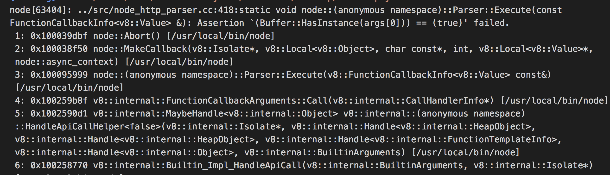

## http

### headers 字段总结
1. Content-Length 告诉服务器 请求体多大
2. Content-Type 告诉浏览器用什么方法对数据进行处理
    > 表单 application/x-www-form-urlencoded
    > json application/json
    > html text/html
    > image/png
3. Range:bytes=0-4 告诉服务器我要多少字节 服务器返回Range:bytes 
0-4/512
4. Cache-Control: max-age=315360000
5. Expires: Fri, 23 Jun 2028 06:30:22 GMT

### 一、http和tcp的区别
```javaScript
let http = require('http')
let server = http.createServer() 
// server.on('connection',(socket)=>{
//     // console.log(socket)
//     socket.setEncoding('utf8')
//     socket.on('data',(data)=>{
//         console.log(data)
//     })
// })

server.listen(3000)


```
> 对于http起的服务,监听的connection，不能再用socket监听data ,否则会报错

http在内部将socket分成可读流req，可写流res，并emit('request',req,res),所以对于http起的服务，我们监听request即可

### 二、浏览器访问服务和curl的区别
> 浏览器访问时 headers好多内容
```javaScript
let http = require('http')
let server = http.createServer()
server.on('request',(req,res)=>{
    console.log(req.method)
    console.log(req.url) //显示path内容 /index/list?b=8 哈希值不会获取到
    console.log(req.httpVersion)
    console.log(req.headers)
    req.on('data',(data)=>{
        console.log(data)
    })
})
server.listen(3000)
//curl 访问时 打印： curl -v localhost:3000
// GET
// /
// 1.1
// { host: 'localhost:3000',
//   'user-agent': 'curl/7.54.0',
//   accept: '*/*' }


// 浏览器 访问时 打印：localhost:3000
// GET
// /
// 1.1
// { host: 'localhost:3000',
//   connection: 'keep-alive',
//   'cache-control': 'max-age=0',
//   'upgrade-insecure-requests': '1',
//   'user-agent':
//    'Mozilla/5.0 (Macintosh; Intel Mac OS X 10_13_6) AppleWebKit/537.36 (KHTML, like Gecko) Chrome/68.0.3440.106 Safari/537.36',
//   accept:
//    'text/html,application/xhtml+xml,application/xml;q=0.9,image/webp,image/apng,*/*;q=0.8',
//   'accept-encoding': 'gzip, deflate, br',
//   'accept-language': 'zh-CN,zh;q=0.9,en;q=0.8',
//   cookie:
//    'Webstorm-5cf4dd14=43ffab86-857a-4f24-8889-bf29bbaec9e0; _ga=GA1.1.1248251848.1504602579; Idea-95ea05cf=64cd4c99-1381-45dc-a621-46a3373c4000; io=xNNSRR1FeHpJ7cVgAAAA; Webstorm-5cf4d953=50a18b62-c7bd-4fc4-a51a-329f7112b686' }

```
> 只要post时，才会触发data事件,application/x-www-form-urlencoded  是默认type，--data为a=3和{a:3}都原样打印

```javaScript
//curl -X POST -v --header "a:1" --data "a=3" http://localhost:3000

//curl -X POST -v --header "a:1" --data "{a:3}" http://localhost:3000
POST
/
1.1
{ host: 'localhost:3000',
  'user-agent': 'curl/7.54.0',
  accept: '*/*',
  a: '1',
  'content-length': '3', //多了两个字段
  'content-type': 'application/x-www-form-urlencoded' }
a=3
//{a:3}

```
### 二、自己写客户端 的断点下载 主要练习Range：bytes=1-8

> 需要注意on('data',(data)=>{})只是接受一部分数据 on('end',()=>{})才是所有数据接受完毕
1. 还有简易爬虫
```javaScript
//一个服务 一个客户端请求别的网址 把请求来的数据通过服务发送给向我们服务请求的客户端

let http = require('http')
let opts = {
    host:'news.baidu.com'
}
let server = http.createServer((req,res)=>{

    http.get(opts,(r)=>{ //get方法相对于request方法不用返回client，并client.end()
        let ary = []
        //接受数据的套路 on('data') 和on('end')
        r.on('data',(data)=>{
            ary.push(data)
        })
        r.on('end',()=>{
            let content = Buffer.concat(ary).toString()
            let list = content.match(/<li class="bold-item"(?:[\s\S]*?)<\/li>/img)
            res.setHeader('Content-Type','text/html;charset=utf-8') //不要忘了
            res.end(list.join(''))
        })
    })
})
server.listen(3000)
```
### 三、常用端口
1. http 80
2. https 443

### 四、html里引入的css 不管前面有几级，都认为是/
### 五、缓存机制
0. 后台没处理时，浏览器的缓存
    > 几乎每次都是重新请求
1. 强制缓存 
> 强制缓存 显示是200 from memory cache or from disk cache
> html不会强制缓存 只有css,js或其他引用
> Cache-Control
> Expires

2. 对比缓存
> res.setHeader('Cache-Control','no-cache') 让浏览器别走自己的缓存机制，每次都发送请求，走不走304，完全由浏览器决定。若没写，即使服务端要求走对比缓存政策，浏览器也会走自己的机制，导致从内存或硬盘读取数据，更新不及时，但有个好处是可以不用每次都发一次http请求
> Last-Modified  if-modified-since ，利用文件的修改时间，只要修改了，就会发送新的内容
> Etag if-none-match,利用相同内容md5后，结果永远相同的原理，若不同，说明文件有改动，则会重新发送，否则走缓存
> 服务端设置头需在发送响应体之前 设置

### 代理 proxy
1. 反向代理
> 反向代理是相对于服务端代理，a向c,借钱，c给了a，但c其实是向b借的。a不知道真正借给他钱的人是谁
```javaScript
let http = require('http')
let httpProxy = require('http-proxy')
let proxy = httpProxy.createProxyServer()
let map = {
    'www.zf1.cn':'http://localhost:3001',
    'www.zf2.cn':'http://localhost:3002',
}
http.createServer((req,res)=>{
    let host = req.headers['host'].split(':')[0]
    console.log(host)
 proxy.web(req,res,{
     target:map[host]
 })
}).listen(8080)
```

2. 正向代理
> a向c借钱，c不借，a让b去向c借钱，c不知道到底谁向他借的钱
```javaScript
let http = require('http')
let httpProxy = require('http-proxy')
let proxy = httpProxy.createProxyServer()

http.createServer((req,res)=>{
    //代理可以加些头信息
    proxy.on('proxyReq', function(proxyReq, req, res, options) {
        proxyReq.setHeader('key', 'zf');
      });
    proxy.web(req,res,{
        target:'http://localhost:3001'
    })
}).listen(8080)

//
let http = require('http')
http.createServer((req,res)=>{
    //相访问的网站要求头部必须有某些信息
    if(req.headers.key=='zf'){
        res.end('3001')
    }else{
        res.end('not founnd')
    }
    
}).listen(3001)
```