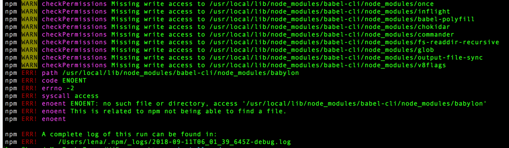

## 在项目内运行Babel CLI
```javaScript
npm install babel-cli -D
```
如果想在终端运行babel，需要在package.json文件中进行配置
```javaScript
 "scripts": {
    "test": "echo \"Error: no test specified\" && exit 1",
    "babel": "babel class.js -o tt.js -w"
    //  "build": "babel src -d build"  //进行批量转码
  },

  //-o --out-file
  //-w //watch
```
然后在终端 npm run babel即可
`需要注意的是想在终端执行babel class.js -o tt.js -w，需要直接配置好，不可以 npm run babel class.js -o tt.js -w`

> 还有需要注意的一点
终端运行npm install babel-cli -g 一直报错

此时需要cd /usr/local/lib/node_modules
并删除babel-cli包，重新install即可