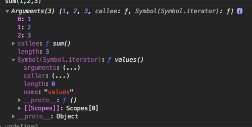

## 类数组转数组

### 类数组对象
定义：

* 拥有length属性，其它属性（索引）为非负整数
* 不具有数组所具有的方法 
常见的类数组有arguments和NodeList，《javascript权威指南》里面给出了一个鉴别对象是否是类数组的函数：
```javaScript
// Determine if o is an array-like object.
// Strings and functions have numeric length properties, but are 
// excluded by the typeof test. In client-side JavaScript, DOM text
// nodes have a numeric length property, and may need to be excluded 
// with an additional o.nodeType != 3 test.
function isArrayLike(o) {
    if (o &&                                // o is not null, undefined, etc.
        typeof o === 'object' &&            // o is an object
        isFinite(o.length) &&               // o.length is a finite number
        o.length >= 0 &&                    // o.length is non-negative
        o.length===Math.floor(o.length) &&  // o.length is an integer
        o.length < 4294967296)              // o.length < 2^32
        return true;                        // Then o is array-like
    else
        return false;                       // Otherwise it is not
}

```
### 类数组转数组方式
1.Array.prototype.slice.call()
这种方法是借用了数组原型中的slice方法，返回一个数组。slice方法的内部实现：
```javaScript
Array.prototype.slice = function(start,end){  
      var result = new Array();  
      start = start || 0;  
      end = end || this.length; //使用call之后this指向了类数组对象
      for(var i = start; i < end; i++){  
           result.push(this[i]);  
      }  
      return result;  
 } 
```
一个通用的转换函数：
```javaScript
var toArray = function(s){  
    try{  
        return Array.prototype.slice.call(s);  
    } catch(e){  
            var arr = [];  
            for(var i = 0,len = s.length; i < len; i++){   
                 arr[i] = s[i];   
            }  
             return arr;  
    } 

```
2.Array.from()
Array.from()是ES6中新增的方法，可以将两类对象转为真正的数组：类数组对象和可遍历（iterable）对象（包括ES6新增的数据结构Set和Map）。

```javaScript
var arrayLike = {
    '0':'a',
    '1':'b',
    '2':'c',
    length:3
};
var arr = Array.from(arrayLike);//['a','b','c']
//把NodeList对象转换为数组，然后使用数组的forEach方法
var ps = document.querySelectorAll('p');
Array.from(ps).forEach(p){
    console.log(p);
});                             
//转换arguments对象为数组
function foo(){
    var args = Array.from(arguments);
    //...
}
//只要是部署了Iterator接口的数据结构，Array.from都能将其转换为数组
Array.from('hello');            //['h','e','l','l','o']

```

3.扩展运算符（...）
同样是ES6中新增的内容，扩展运算符（…）也可以将某些数据结构转为数组
```javaScript
//arguments对象的转换
function foo(){
    var args = [...arguments];
}
//NodeList对象的转换
[...document.querySelectorAll('p')]

```
扩展运算符实际上调用的是遍历器接口，如果一个对象没有部署此接口就无法完成转换
---------------------------------------------
### 先认识下类数组

> 类数组虽是对象，但和数组很相似，却有length。
```javaScript
function sum(){
    console.log(arguments)
}
sum(1,2,3)

//[Arguments] { '0': 1, '1': 2, '2': 3 }

```

```javaScript
function sum(){
    console.log([...arguments])//方法一
    console.log(Array.from(arguments))//方法二
}
sum(1,2,3)

```
`但二者是有区别的看下面例子：`
```javaScript
let ary = {0:1,1:2,2:5,length:3}
console.log(Array.from(ary))//[ 1, 2, 5 ]
console.log([...ary])//TypeError: ary is not iterable
////只要是部署了Iterator接口的数据结构，Array.from都能将其转换为数组
Array.from('hello');            //['h','e','l','l','o']

```
> 可以看出Array.from对于任何类数组都可以转化成数组，但扩展运算符的方式则不是，它需要类数组具体迭代器，arguments之所以可以用此方法，就是因为它具有与生俱来就有迭代器，与其相同的还有Dom类数组。但问题来了，普通类数组就不可以了么，当然可以，缺啥补啥即可。

```javaScript
let ary = {0:1,1:2,2:5,length:3,[Symbol.iterator]:function *(){
    let index = 0;
    while(index != this.length){
        yield this[index++]
    }
}}
// console.log(Array.from(ary))
console.log([...ary])
```
