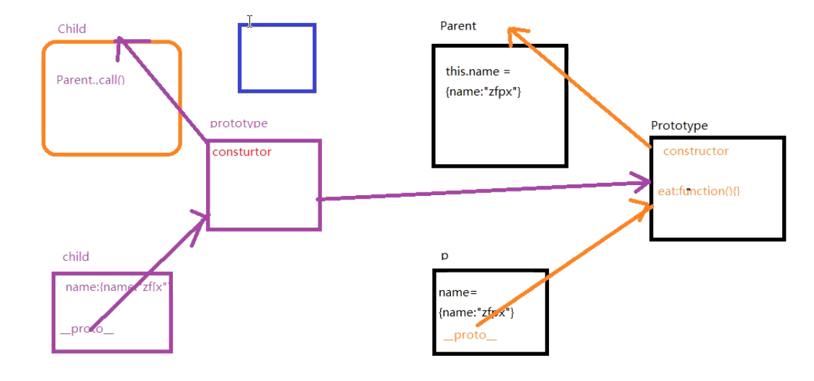
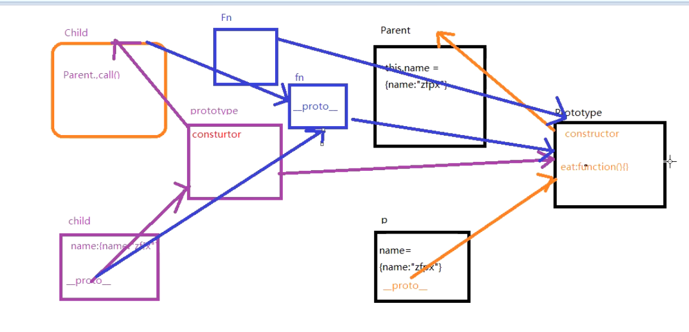

私有属性继承
```javaScript
function Parent(){
    this.name = {name:'zf'}
}
Parent.prototype.eat = function(){
    console.log('eat')
}

function Child(){
    Parent.call(this)//私有
}
```
公有属性继承
1. 
```javaScript
Object.setPrototypeOf(Child.prototype,Parent.prototype)//公有
Child.prototype.__proto__ = Parent.prototype//公有
```

2.

```javaScript
Child.prototype = Object.create(Parent.prototype,{constructor:{value:Child}})//公有

//create的实现
function myCreate(parentPrototype){
    function Fn(){}
    Fn.prototype = parentPrototype
    return new Fn()
}
```


