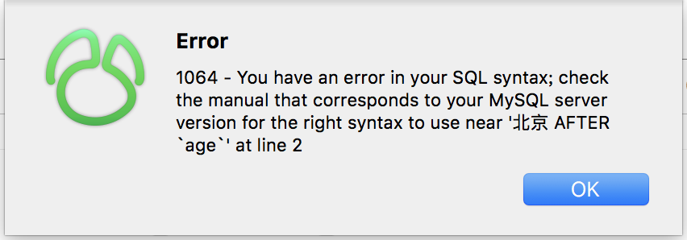
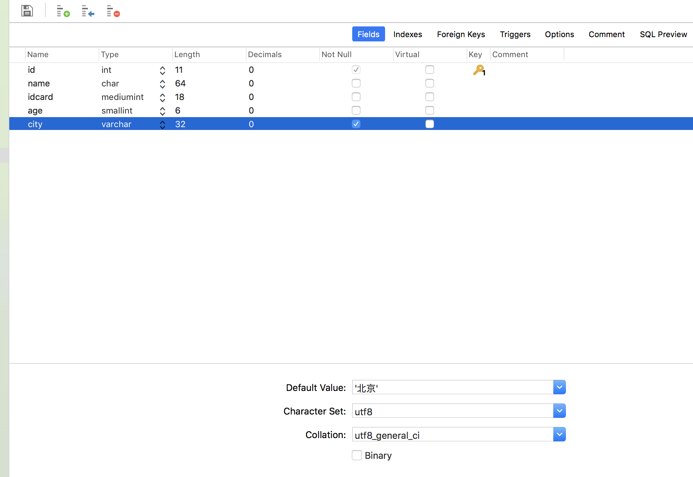

## 一、第一步：停止MySQL服务。 
可能在使用MySQLWorkBench之前，你就开启了MySQL服务，所以这里需要关闭MySQL服务。 
关闭MySQL服务的操作： 
苹果->系统偏好设置->最下边点MySQL 在弹出页面中 关闭mysql服务（点击stop mysql server）
## 二、第二步：进入终端，指令重启MySQL服务。 
1. 打开终端： 
2. 输入指令1：（进入到mysql的bin目录下） 
输入：cd /usr/local/mysql/bin/ 
3. 输入指令2： 
输入：sudo ./mysqld_safe --skip-grant-tables 
4. 输入指令2，会提示输入密码：（Mac账户的root用户密码）

5. 输入密码后：会出现一堆提示：

6. 然后会发现，MySQL会自动重启。

## 第三步：另外开一个终端，设置MySQL密码。

1. 另外再开一个终端： 
2. 输入指令1：（进入到mysql的bin目录下） 
输入：cd /usr/local/mysql/bin/ 
3. 输入指令2： 
输入：./mysql 
4. 进入到mysql命令状态下：（mysql>是mysql命令状态提示） 
输入：mysql> FLUSH PRIVILEGES; 
5. 设置密码admin123 
输入：mysql> SET PASSWORD FOR 'root'@'localhost' = PASSWORD('admin123');

https://blog.csdn.net/idoshi201109/article/details/73381505

## 安装后出现问题
安装完后，终端出现如下情况：
bash-3.2$ mysql
bash: mysql: command not found

解决方案：发现~/.bash_profile里面配上路径了
export PATH=$PATH:/usr/local/mysql/bin。

那就在终端输入 source ~/.bash_profile

## 整数型范围 比如int 4*8=32 ，最大数据为 2的31次方

### 主键： 代表一个人的身份 具有特点:一、无意义，二、不可重复

### 联合主键： 两个键合起来才能确定一个元素，所以需要联合起来
### 外键：别人家的主键
> 如果一个表一个外键引用了另一个表的主键。那么会有以下限制
> 1. 在外键表里不能添加主键表里没有的数据。
> 2. 要想删除主键表的数据，必须删除 所有的外键表的数据。

## 后台数据库是如何创建的。
1. 项目比较简单的话，就是像我这样创建
2. 如果项目比较大的话，先用powerdesigner设计表，然后生成SQL语句，再去DBMS里执行
3. 直接基于模型来做 ORM工具 hibernate squ waterline  

## 设置默认值时会出现如下错误：

解决方法：

> 字符串需要加上引号