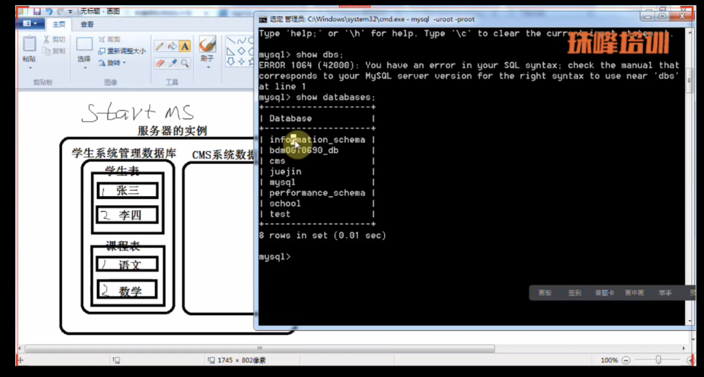

### windows mysql配置 步骤
typical -> multifunctionnal Database -> decision support (dss)/olap ->设置port 3306 -> 手动选择编码utf8 -> service name MySql 并写入Path -> 输入账号和密码 并创建匿名账号

## 在安装路径里有my.ini文件，所有设置都在这里，也可以直接修改此文件

## 有两种所有引擎
InnoDB 可以有事务，但慢
MYISAM 没有事务，但快

## MySQL也分为客户端和服务端，服务端为mysqld （deamon守护神的意思） ，客户端为mysql

## 启动服务后，用下面命令链接数据库
```javaScript
mysql -uroot -proot
```



## 常用命令
1. show database
2. use
3. show tables
4. desc users //展示结构
5. select database() //此时的数据库是哪个

## msqyl界面操作有一下几种：
1. navicat
2. sqlyog

 注意：
1. char 方便查询 就这么
varchar 节省空间 需要定义长度，不允许超过最大长度，若占不完，则让给别人

2. 标识列具有断号保存的特点
也就是初始值为1，递增为3 。1、4、7、10如果加到7时删除此行，之后加入的行的标识符仍是10.

3. 增加的时候，先增加主表，再增加副表，删除时，先删副表，再删主表

4. sql语句不区分大小
