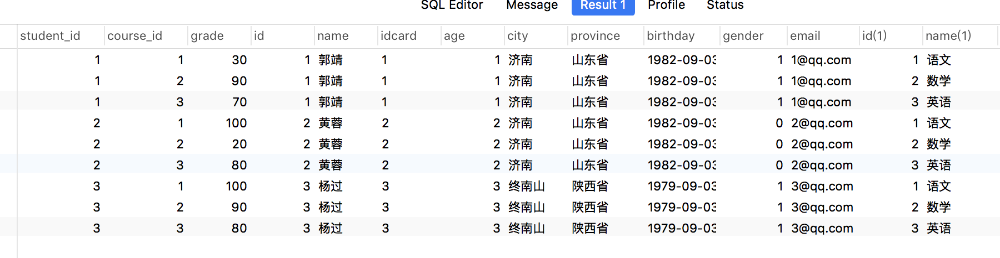
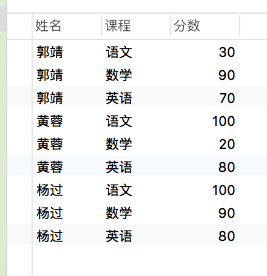
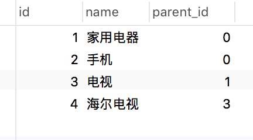

## 新建表
```javaScript
-- 创建学生表
DROP TABLE student
CREATE TABLE `student`
(
id int NOT NULL,
name VARCHAR(64) NOT NULL,
age int NOT NULL,
city VARCHAR(32)
)
-- 增加身份证号列
ALTER TABLE student ADD COLUMN idcard VARCHAR(18) NULL;
-- 修改列
ALTER TABLE student MODIFY COLUMN idcard VARCHAR(32) NULL;
-- SELECT * FROM student
DESC student
-- 删除一列
ALTER TABLE student DROP COLUMN idcard
-- 添加主键约束
ALTER TABLE student ADD PRIMARY KEY(id) AUTO_INCREMENT;
-- 添加唯一约束
ALTER TABLE student ADD UNIQUE INDEX uq_index(idcard)
-- 增加默认值
ALTER TABLE student MODIFY COLUMN city VARCHAR(32) DEFAULT '北京'

id
name
age
city
idcard
-- 在age后面加一列
ALTER TABLE student ADD COLUMN province VARCHAR(32) AFTER age;

CREATE TABLE score
(
student_id int
)
-- 创建约束
ALTER TABLE score ADD CONSTRAINT fk_student_id FOREIGN KEY(student_id) REFERENCES student(id)
-- 在项目永远不会创建这个约束
ALTER TABLE score DROP FOREIGN KEY fk_student_id;
DESC score 
// 表的结构
```

DDL 数据定义语言（建表）
DML 数据操作语言（对表中数据进行操作）
DCL 数据控制语言(用户权限和分组)

## 操作表
```javaScript
INSERT INTO
student(name,idcard,age,city)
VALUES('张三','100',78,DEFAULT)

-- id 6 idcard= 300，age=18
UPDATE student 
SET idcard=200,age=89
WHERE id=6;

UPDATE student
SET city='北京'
WHERE id=1 OR id=3;
SELECT * FROM student
WHERE city IS NOT NULL; //是否为空 需要is not

DELETE FROM student
WHERE idcard=200;
-- 普通的SQL操作会就日志，并且可以还原
-- truncate操作不会记录日志，并且不会还原

TRUNCATE TABLE student
```
## 查询表 select

```javaScript
//name 姓名 表示用姓名替换name域名,也可以写成name as 姓名， '中国' as 国家 表示增加国家这一列，并且都是‘中国’，二者主要区别是前面是变量还是字符串
SELECT id,name 姓名,idcard,city 城市, '中国' as 国家
FROM student
WHERE city='北京'
ORDER BY id ASC
// ASC表示顺序 DESC 反序

//查询不重复的城市
SELECT DISTINCT city
FROM student

SELECT *
FROM student
LIMIT 3
-- 3表示只要三条

SELECT *
FROM student
LIMIT 3,2
-- 跳过3条 只要2条

SELECT * FROM score
ORDER BY course_id ASC, grade DESC
// 先按course_id 升序，在course_id一样的情况下，再按grade进行降序

// + 号不再代表字符串拼接，只作为加法，为字符串为0，null和其他相加为null
//字符串的拼接
SELECT 1+1; //2
SELECT NULL+1; //NULL
SELECT 'a'+'b'; //0
SELECT CONCAT('a','b') //ab
```

`逻辑运算符： AND OR NOT
比较运算符：= > < >= <= !=`

### 自定义函数
### between and  以及in

### 聚合函数
```javaScript
SELECT COUNT(grade) FROM score
WHERE student_id = 1;
```
`需要注意的是count统计的是非null的值，若grade有一项为null，不会将其统计进去，并且在求avg值时也不包括这个null一项`

### 分组  分组筛选
`列表中只能包含：`
* 被分组的列
* 为每个分组返回一个值的表达式，如聚合函数
```javaScript
select student_id,avg(grade) from score group by student_id;
```
###  查询条件排序
```javaScript
SELECT  FROM  <表名>
WHERE 
GROUP BY {col_name|expr|position}
HAVING  {col_name|expr|position}
ORDER BY {col_name|expr|position} [ASC|DESC]
LIMIT offset,row_count
```

### 子查询 只能返回一条或者一个值。但也可以返回一组，我们需结合some any all使用，还有in ,not in,exists, not exists
```javaScript

SELECT * from student WHERE age > (SELECT ROUND(AVG(age),2) FROM student)

SELECT * FROM student
WHERE EXISTS(
SELECT student_id FROM score
WHERE score.student_id = student.id)
```

### 表连接:inner join / left join/ right join

表的连接是每一项和另一个表的每一项进行连接，比如一张表有5行，另一张有9行，则匹配出会有5*9=45条， on是对结果进行筛选
```javaScript
SELECT *
FROM score
INNER JOIN student ON score.student_id = student.id
INNER JOIN course ON score.course_id = course.id
```
结果：


出来这个结果后，我们可以得到想要结果

```javaScript
SELECT student.`name` 姓名,course.`name` 课程,score.grade 分数
FROM score
INNER JOIN student ON score.student_id = student.id
INNER JOIN course ON score.course_id = course.id

```


## 无限分类
设计表格如下：通过parent_id查找到上一级

