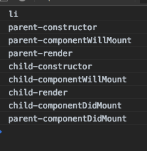

## react生命周期
* componentWillMount
* render
* componentDidMount
* shouldComponentUpdate
* componentWillUpdate
* componentDidUpdate
* componentRecevieProps
* componentUnmountr

```javaScript
import React,{Component} from 'react'
import ReactDom from 'react-dom'

class Counter extends Component{
    static defaultProps = {
        name:'li'
    }
    state = {
        num:0
    }
    constructor(props){
        super()
        console.log(props.name)
        console.log('parent-constructor')
        
    }
    componentWillMount(){
        console.log('parent-componentWillMount')
    }
    componentDidMount(){
        setTimeout(()=>{
            this.setState({num:this.state.num + 1})
        },1000)
        console.log('parent-componentDidMount')
    }
    shouldComponentUpdate(){
        console.log('parent-shouldComponentUpdate')
        return true
    }
    componentWillUpdate(){
        console.log('parent-componentWillUpdate')
    }
    componentDidUpdate(){
        console.log('parent-componentDidUpdate')
    }
    componentWillUnmount(){
        console.log('parent-componentWillUnmount')
    }
    handleClick = ()=>{
        this.setState({num:this.state.num + 1})
    }
    render(){
        console.log('parent-render')
        return (
            <div>
                <button onClick={this.handleClick}>+</button>
                {this.state.num}
                {/* <Child name='li' age='7' hobby={this.state.num}></Child> */}
            </div>
        )
    }
}

class Child extends Component{
    constructor(props){
        super()
        console.log('child-constructor')
        
    }
    componentWillMount(){
        console.log('child-componentWillMount')
    }
    componentDidMount(){
        console.log('child-componentDidMount')
    }
    componentWillReceiveProps(){
        console.log(arguments)
        console.log('child-componentWillReceiveProps')
    }
    shouldComponentUpdate(){
        console.log('child-shouldComponentUpdate')
        return true
    }
    componentWillUpdate(){
        console.log('child-componentWillUpdate')
    }
    componentDidUpdate(){
        console.log('child-componentDidUpdate')
    }
    componentWillUnmount(){
        console.log('child-componentWillUnmount')
    }
    render(){
        console.log('child-render')
        return (
            <span>{this.props.name}</span>
        )
    }
}
ReactDom.render(<Counter></Counter>,window.root)
```
首次运行时的打印结果<br/>


setState之后渲染的结果<br/>


`从localstorage获取数据时，是同步代码，所以在componentWillMount去获取，render执行一次；如果是ajax，是异步代码，所以放在componentWillMount和componentDidMount效果都一样,都会执行两次render`

`只能在componentWillMount、componentDidMount、componentWillReceiveProps钩子中获取数据，但最后不要用最后一个`