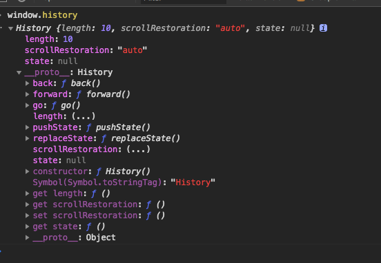
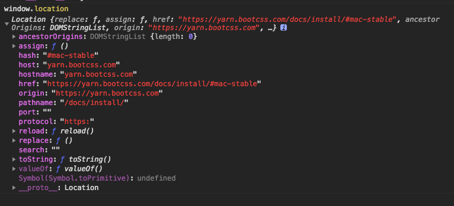

# react router路由实现原来
## HashRouter
> 原理就是用a href实现，如何hash值改变时，页面也相应改变呢，那就主要依靠hashchange事件喽
```javaScript
    <a href="#/a">a页面</a>
    <a href="#/b">b页面</a>
    <div id="span""></div>
    <script>
        window.addEventListener('hashchange',(e)=>{
            span.innerHTML = window.location.hash
        })
    </script>
```

## BrowserRouter
> 原理是利用h5新加方法pushState，用popstate监视路由的改变
```javaScript
    <div onclick="fn('/a')">a页面</div>
    <div onclick="fn('/b')">把页面</div>
    <div id="span"></div>
    <script>
     function fn(pathname){
         window.history.pushState({name:'li'},'a',pathname)
         span.innerHTML = window.location.pathname

     }
     window.addEventListener('popstate',(e)=>{
         console.log(e)
         span.innerHTML = window.location.pathname
     })
    </script>
```

附上window.history 和window.location的属性

